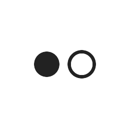
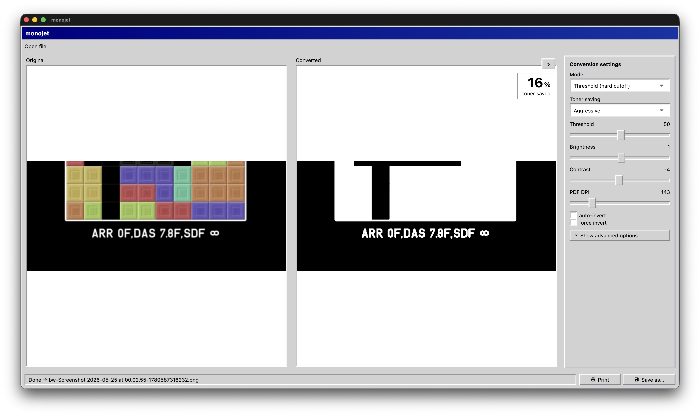

<p align="left"></p>

# monojet

CLI tool to convert images (and PDFs) to black-and-white optimized for **cheap laserjet printing**. Built with [Babashka](https://babashka.org/) (Clojure) and [ImageMagick](https://imagemagick.org/).

Unlike a generic grayscale conversion, this tool is aimed at minimizing toner usage: it lightens midtones with gamma correction, optionally inverts dark backgrounds (so a black page becomes a white page), and picks a B&W rendering that matches the content type — local adaptive threshold for text, error-diffusion or halftone for photos. Multi-page PDFs are supported in and out. Each run prints a coverage report so you can see roughly how much toner you'll save.

## Install

The install script checks that all requirements are present before downloading.

```bash
curl -fsSL https://raw.githubusercontent.com/ampersanda/monojet/main/install.sh | bash
```

### Requirements

The following must be installed **before** running the install script:

- [Babashka](https://github.com/babashka/babashka) (bb)
- [ImageMagick](https://imagemagick.org/) (magick)
- [Ghostscript](https://www.ghostscript.com/) (gs) — required only if you want to convert PDFs

```bash
brew install borkdude/brew/babashka imagemagick ghostscript
```

The script installs `monojet` to `~/.local/bin`. Make sure it is in your `PATH`:

```bash
export PATH="${HOME}/.local/bin:${PATH}"
```

### Update

Re-run the install command. It detects existing installs and updates in place:

```bash
curl -fsSL https://raw.githubusercontent.com/ampersanda/monojet/main/install.sh | bash
```

### Uninstall

```bash
rm ~/.local/bin/monojet
```

## Usage

If installed via the install script:

```bash
# Convert a single image (default mode: text)
monojet screenshot.png -o printable.png

# Convert all images in a directory; outputs go to ./bw-output/
monojet -d screenshots/

# Photo-friendly Floyd-Steinberg dithering, with aggressive toner saving
monojet photo.jpg -m dither -T 3 -o photo-bw.png

# Auto-invert if the background is dark (e.g. dark-mode terminal screenshots)
monojet -i terminal.png -o terminal-bw.png

# Verbose output (per-image stats)
monojet -v -d screenshots/ -o output/

# PDF in -> B&W PDF out (multi-page preserved)
monojet zine.pdf -m text -o zine-bw.pdf

# Higher DPI rasterization for sharper PDF output
monojet zine.pdf -m text -D 300 -o zine-bw.pdf
```

Or run directly with Babashka:

```bash
bb convert -- image.png -o out.png
bb convert -- -d screenshots/ -o output/
bb -m monojet.core image.png -o out.png
```

## Options

| Flag | Description | Default |
|---|---|---|
| `-o, --output` | Output file (single input) or directory (multiple) | `bw-<input>` / `./bw-output/` |
| `-d, --dir` | Read all images from directory | |
| `-m, --mode` | `text`, `threshold`, `dither`, `halftone`, `gray` | `text` |
| `-t, --threshold` | Threshold % (text/threshold modes, 0-100) | 50 |
| `-T, --toner-saving` | Toner-saving lightening: 0 (off) - 3 (aggressive) | 2 |
| `-b, --brightness` | Brightness adjustment (-100..100) | 0 |
| `-c, --contrast` | Contrast adjustment (-100..100) | 0 |
| `-i, --auto-invert` | Invert if dark background detected | off |
| `--invert` | Force invert | off |
| `-D, --density` | Rasterization DPI for PDF input (30-600) | 150 |
| `-v, --verbose` | Print progress info | |
| `-V, --version` | Show version | |
| `-h, --help` | Show help | |

## Modes

| Mode | When to use | What it does |
|---|---|---|
| `text` | Documents, screenshots, code | ImageMagick `-lat 20x20` local adaptive threshold; keeps text crisp on uneven backgrounds |
| `threshold` | High-contrast B&W source | Hard global threshold; smallest output, no midtones |
| `dither` | Photos | Floyd-Steinberg error diffusion (`-colors 2`); fine detail, smooth gradients |
| `halftone` | Photos for newspaper-like look | Ordered dither (`h6x6o`); regular dot pattern |
| `gray` | Charts/diagrams | Lightened grayscale (no B&W conversion); use when toner-saving alone is enough |

> **Avoid `threshold` mode on images with large solid color regions** (e.g. ID cards with a coloured photo background, brand banners). A flat mid-tone block will collapse to solid black, which is the opposite of toner saving. Use `dither` or `halftone` instead — both reproduce solid colours as sparse dot patterns.

## How it works

1. Reads the image with ImageMagick and computes its mean luminance.
2. If `-i` is set and the image is mostly dark, the pipeline starts with `-negate` so the background becomes white (massive toner savings on dark-mode UIs).
3. Converts to grayscale, then applies a gamma curve (`-evaluate Pow`) tuned by `-T` to lighten midtones — gray boxes, light shadows and anti-aliased edges become lighter or disappear entirely.
4. Applies the chosen mode-specific operator (adaptive threshold, ordered dither, etc.).
5. Re-measures luminance of the output to estimate ink coverage and report toner savings vs. the original.

A typical UI screenshot drops from ~40% ink coverage to ~5–10% after `text` mode with `-T 2`.

## PDF support

Both input and output PDFs are handled when Ghostscript is available. Multi-page input PDFs are rasterized page-by-page at `-D` DPI (default 150). If your output extension is `.pdf`, all pages are written into a single multi-page B&W PDF. The `text` mode's local-window size scales with `-D` so titles in large fonts don't render as outlines at higher DPI.

For text-heavy documents start with `-m text -T 1`. For zines or comics with photos, `-m halftone -T 2` keeps photos legible while staying toner-cheap.

## Desktop app (macOS)

A small Flutter desktop app under `flutter-desktop/` wraps the CLI for drag-and-drop use. It's built with [ClojureDart](https://github.com/Tensegritics/ClojureDart) + [flutter95](https://pub.dev/packages/flutter95) for Win95-style chrome.



### Highlights

- Drop a file (or click the **Original** pane) and conversion runs automatically — no Convert button to press.
- **Automatic** mode (default) runs every CLI mode in parallel and shows the result of whichever saved the most toner. A small "auto · dither" caption under the toner-saved % reveals which mode won.
- If a non-inverted run could be improved by inverting (e.g. dark-mode screenshot), a modal pops with the savings comparison and one click to apply.
- Threshold / brightness / contrast are **sliders**. Path/binary fields are tucked behind a **Show advanced options** toggle.
- **Save as…** to write the result anywhere; **Print** to send it to your default printer (with a confirmation modal).
- Every settings change re-runs conversion after a 400 ms debounce.
- Self-updates: the title bar shows the current version, and the toolbar's **Check for updates** button swaps in the latest release in place.

### Install the desktop app (macOS)

1. Make sure ImageMagick is installed (Ghostscript only needed for PDFs):

   ```bash
   brew install imagemagick ghostscript
   ```

2. Download the latest [monojet-desktop-mac-arm64.zip](https://github.com/ampersanda/monojet/releases/latest/download/monojet-desktop-mac-arm64.zip) (Apple Silicon only), unzip it, and drag `monojet.app` to `/Applications`.

   ```bash
   curl -L -o monojet.zip \
     https://github.com/ampersanda/monojet/releases/latest/download/monojet-desktop-mac-arm64.zip
   unzip monojet.zip && mv monojet.app /Applications/
   ```

3. The app is not yet notarized, so the first launch needs Gatekeeper bypass: **right-click → Open** in Finder and confirm. Subsequent launches work normally.

### Updating the desktop app

The app checks for a new release on launch and again any time you click **Check for updates** in the toolbar. When a newer version is available, accepting the prompt downloads the latest `monojet-desktop-mac-arm64.zip` from GitHub, swaps it over the current install via a short detached shell script, and re-launches on the new version. The previous bundle is kept as `monojet.app.bak` until the swap completes successfully.

### Build from source

If you'd rather build it yourself:

```bash
cd flutter-desktop
clj -M:cljd flutter -d macos     # dev: compiles cljd → Dart and launches
flutter build macos              # release: produces flutter-desktop/build/macos/Build/Products/Release/monojet.app
```

The Xcode build phase **Bundle monojet runtime** copies `bb`, `monojet.bb`, `bb.edn`, and `src/` into the .app's `Contents/Resources/monojet/` so the bundle ships the conversion logic. `magick` (and `gs` for PDFs) must still be installed on the target machine — install via `brew install imagemagick ghostscript`. macOS deployment target is 11.0; minimum window size is 880 × 540.

## Mobile app (iOS / iPadOS)

A second Flutter target under `flutter-mobile/` builds an iOS / iPadOS version of monojet. Same flutter95 chrome as the desktop, with a responsive layout: stacked previews on iPhone, side-by-side previews + persistent sidebar on iPad (breakpoint is 600 dp logical pixels).

**The mobile app is not on the App Store yet — building it yourself is the only way to run it for now.** Submission is on the roadmap once the conversion engine has had more real-world tuning.

### Differences from the desktop build

- **Image only.** PDF input / output is not supported on mobile (iOS doesn't ship Ghostscript and shipping a static build would balloon the IPA).
- **No subprocess.** The conversion pipeline runs in pure Dart via the [brendan-duncan/image](https://pub.dev/packages/image) package — gamma, brightness/contrast, LAT (via Gaussian blur), Floyd–Steinberg, 8×8 Bayer halftone, threshold, gray. Output is 2–5× slower than ImageMagick but stays self-contained, App Store friendly, and offline-only.
- **Auto-mode is narrower.** Instead of racing every mode, mobile races `text` + `dither` + `halftone` (chosen for highest toner-savings yield on representative inputs).
- **Open** opens iOS's document picker (UIDocumentPickerViewController) — drag-and-drop is desktop-only.
- **Save** routes through the iOS Share Sheet, so the converted file lands in Files, Photos, AirDrop, mail, etc.
- **Print** uses AirPrint. The raster output is wrapped in a single-page PDF on the fly.
- **No in-app updater.** App Store will handle updates once it's published.

### Build from source

Requirements:
- Xcode (CLI tools and a recent stable release)
- Flutter SDK (any recent stable channel)
- Clojure CLI (`brew install clojure/tools/clojure`)
- An Apple Developer account if you want to install on a physical device (simulator runs without one)

```bash
cd flutter-mobile
flutter pub get
clojure -M:cljd compile

# Run on a booted iOS simulator:
flutter run -d <simulator-udid>

# Or build a release .ipa (unsigned — for device install you still need
# to open ios/Runner.xcworkspace in Xcode and sign with your team):
flutter build ios --release --no-codesign
```

Bundle id is `dev.ampersanda.monojet.mobile` (distinct from the desktop's `dev.ampersanda.monojet`).

There is **no CI for mobile** — each build is a manual local run. The intent is to keep CI cost down until the app ships in the store.

## Project structure

```
bb.edn                            # Project config (no external deps)
monojet.bb                        # Entry point for uberscript bundling
src/monojet/
  core.clj                        # CLI parsing, orchestration, reporting
  imagemagick.clj                 # ImageMagick interop (identify, analyze, convert)
flutter-desktop/                            # macOS desktop app (shells out to bb + magick + gs)
  deps.edn                                  # ClojureDart deps + :cljd/opts + :local/root → flutter-shared
  pubspec.yaml                              # desktop_drop, file_picker, flutter95, http, …
  src/monojet_desktop/
    core.cljd                               # Layout, subprocess plumbing, modals
    state.cljd                              # Constants + the defonce app-state atom
    updater.cljd                            # GitHub release check + in-place swap
  lib/main.dart                             # Re-exports the cljd-compiled entry point
  macos/                                    # Flutter macOS scaffold (Xcode project, entitlements, icons)
flutter-mobile/                             # iOS / iPadOS app (pure-Dart engine, image-only)
  deps.edn                                  # ClojureDart deps + :cljd/opts + :local/root → flutter-shared
  pubspec.yaml                              # flutter95, image, file_picker, printing, share_plus, …
  src/monojet_mobile/
    core.cljd                               # LayoutBuilder phone/iPad split, picker, share, AirPrint
    state.cljd                              # Mobile config + state (no subprocess fields, no PDF)
    engine.cljd                             # Pure-Dart conversion pipeline (alpha-flatten, gamma, LAT, FS, halftone)
  lib/main.dart                             # Re-exports the cljd-compiled entry point
  ios/                                      # Flutter iOS scaffold (Xcode project, Info.plist)
flutter-shared/                             # cljd widget package consumed via :local/root
  deps.edn
  src/monojet_shared/widgets/
    form.cljd                               # labeled-field, num-field, slider-field, …
    buttons.cljd                            # icon-button, chevron-toggle (a11y-wrapped)
    preview.cljd                            # tappable image/PDF preview tile
    stat.cljd                               # big-number stat card
    modal.cljd                              # reusable centered modal
```

## References

- [ImageMagick: Local Adaptive Thresholding](https://imagemagick.org/script/command-line-options.php#lat) - used for the `text` mode
- [ImageMagick: Quantization & Dithering](https://imagemagick.org/Usage/quantize/) - background on `-monochrome` and `-ordered-dither`
- [HP toner-saving guidance](https://support.hp.com/) - inspiration for the toner-saving gamma defaults

## Credits

Assisted by [Claude Code](https://claude.com/claude-code).

## License

MIT
